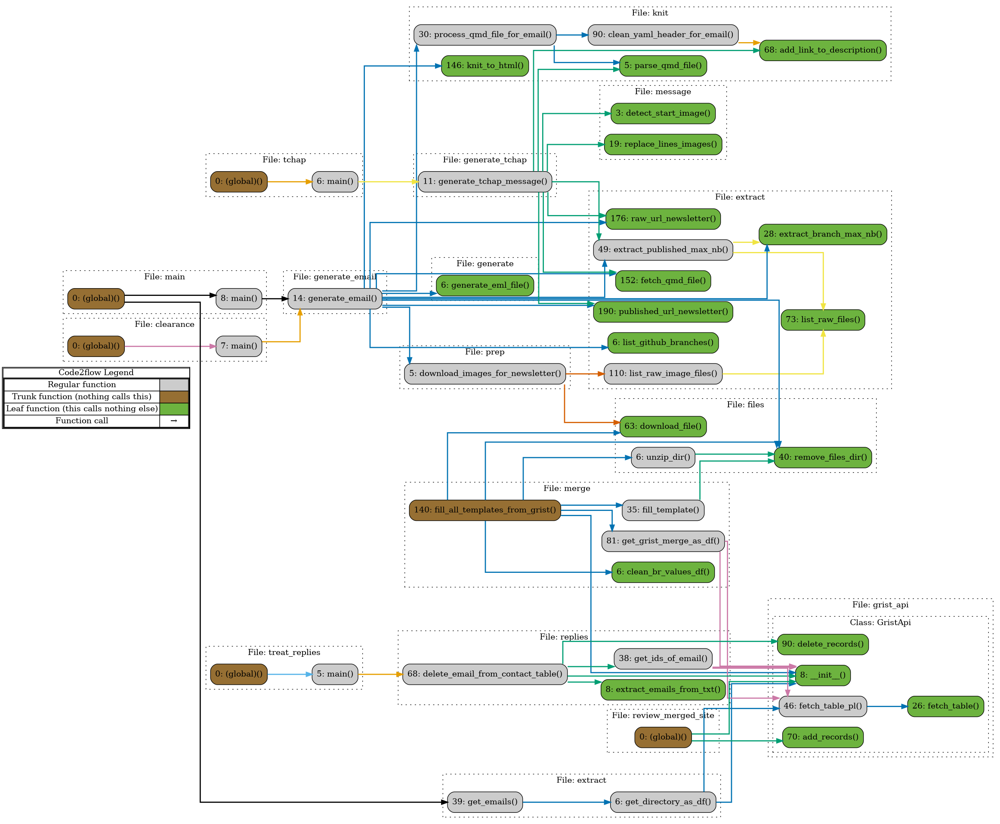
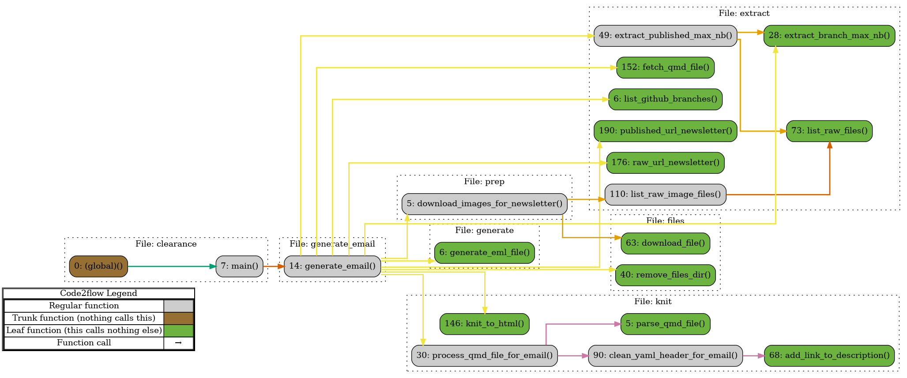
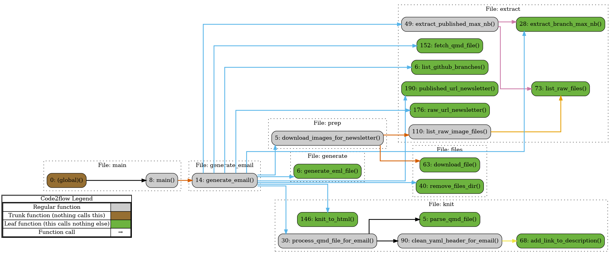
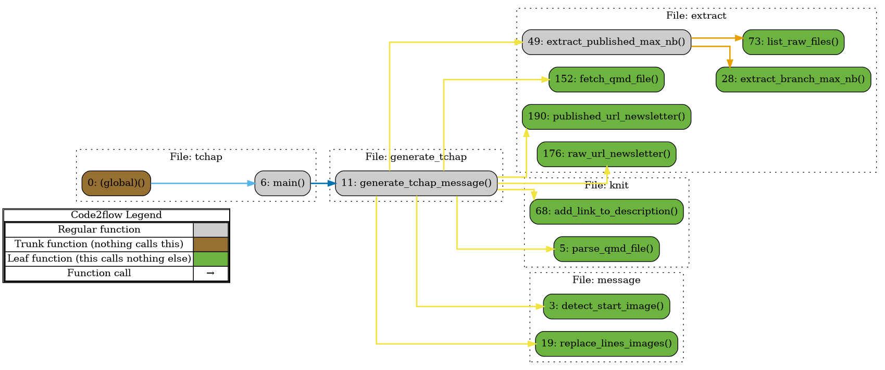
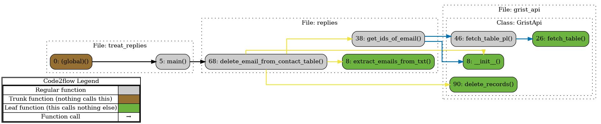

# Objective

Tools to manage [SSPHub's](https://ssphub.netlify.app/) directory and [SSPHub's](https://ssphub.netlify.app/) newsletter system.

# Use

## Requirements

- Have access to GRIST directory
- Have environment variables :
  - GRIST_API_KEY : your API Key to use Grist (see [GRIST documentation](https://support.getgrist.com/rest-api/) to see how to access it)
  - GRIST_SSPHUB_DIRECTORY_ID : GRIST id of the SSPHub's Directory document (available on Grist)
  - GRIST_SSPHUB_WEBSITE_MERGE_ID : GRIST id of the internal table to merge old website to new website (available on Grist)
  - EMAIL_VALIDATION_TO, EMAIL_VALIDATION_CC, EMAIL_SSPHUB : email addresses

- Pour générer l'email de newsletter, les images doivent être stockées dans le repo git. Les images incluent directement avec des liens ne seront pas inclues dans l'email
- la newsletter doit être stockée dans un fichier "index.qmd" stocké dans infolettre/infolettre_XX où XX est le numéro de l'infolettre. Si pas là, le lien de la newsletter publiée dans l'email ne sera pas le bon.
- nom de la branche par défaut dans l'argument du script est 'newsletter_XX', avec le nom du folder où aller chercher le "index.qmd" identique.

## Step by step

### Newsletter

L'objectif ici est de valider et d'envoyer la newsletter du SSPHub aux membres inscrits sur Grist.

#### Validation de la newsletter :

- Faire une PR sur le site
- Envoyer le lien à RL, MH
- reprendre les commentaires
- Ouvrir Onyxia
- Avoir ce repo chargé
- `cd newsletter_tools`
- To generate email :
  - from the CLI, use `uv run clearance.py`.
    - By default, clearance.py will catch the branch named "infolettre_NN" (NN a number) and retrieve NN as the number of the infolettre.
    - If you specify branch and number, do it with `uv run clearance.py -n 21 -b infolettre_21`
  - deprecated - You can also do it manually by going to script.py, and run function generate_email with Object. But it creates issues with working directory for css (file : email/css/style.css)
- download email
- add text to say It's the newsletter for clearance
- send it

#### Envoi de la newsletter

- Email :
  - To generate draft email :
    - from the CLI, use uv run main.py.
      - By default, main.py will look for folders named infolettre/infolettre_NN in the main branch and retrieve the max number.
      - For example `uv run main.py -o "[SSPHub] - Infolettre de décembre 2025"` to specify the object of the email.
    - deprecated - You can also do it manually by going to script.py, and run function generate_email with Object.
      But it creates issues with working directory for css (file : email/css/style.css)
  - Download email
  - Check the newsletter (format, typos etc)
  - Select the right Outlook account
  - Deal with FMB and global lists (?)
  - Press Send
- Tchap :
  - to generate tchap message : from the CLI, use `uv run tchap.py`. Infolettre nb is an optionnal argument (it will fetch it directly from the main branch). If you want to specify it, do it with `uv run main.py -n 23 `
  - copy paste txt stored in .temp/tchap_message.txt in the SSPHub Tchap group

#### Après envoi :

- Cleaning de la mailing list : copier tous les messages d'erreurs dans le fichier "newsletter_tools/replies.txt"
- Pour les supprimer : from the CLI, use uv run treat_replies.py with file path as argument. If file is "newsletter_tools/replies.txt", no need to specify file path. For example `uv run treat_replies.py -f otherfolder/replies.txt` or `uv run treat_replies.py` if default file is used
- the script returns a dataframe with extracted emails, and the one matched in the directory. If emails are not found, it wont delete any email.

### Fusion site SSPHub / SSPLab (deprecated)

- (deprecated) To import draft template to SSPHub's site, go to script.py and run fill_all_templates_from_grist

# Documentation

The graph can be generated with `graphs.sh`

## Clearance

Function to generate a draft email based on newsletter number and branch name of the repo for clearance.
Not necessary to have published the newsletter.

## Main

Function to generate a draft email based on newsletter number and branch name of the repo.
Very similar to generate email for clearance, except that it retrieves the directory and that newsletter must be published..

## Tchap

Function to generate a draft Tchap version of the newsletter based on its number.
Newsletter must be published.

## Treat replies

Function to delete a detect emails and delete them from directory after newsletter has been sent.

