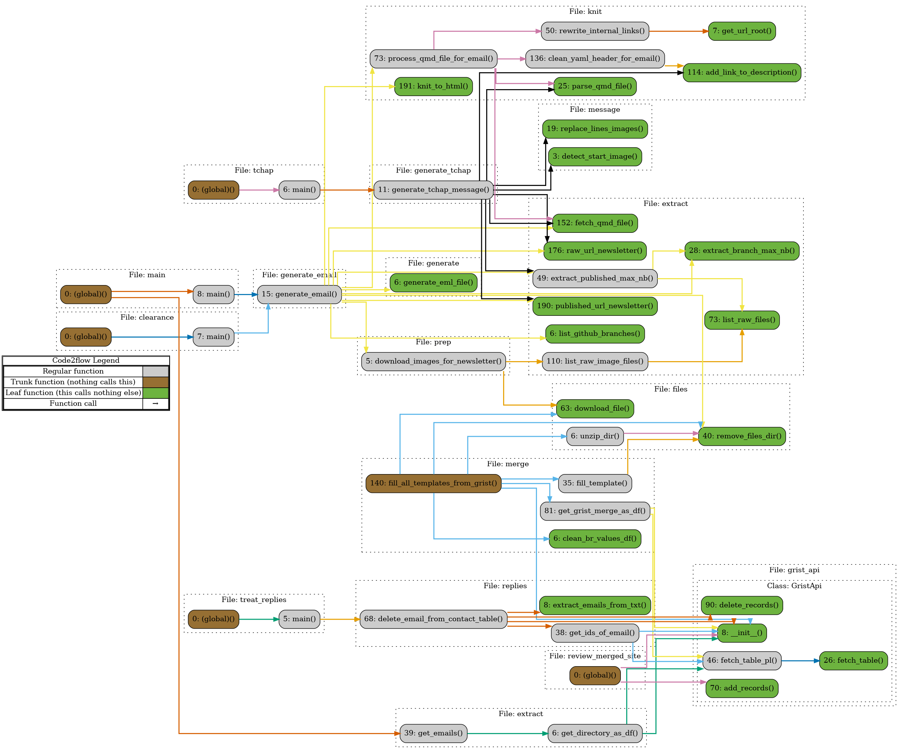
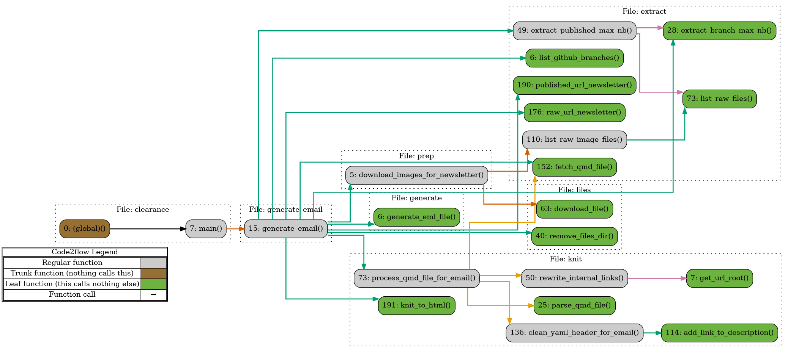
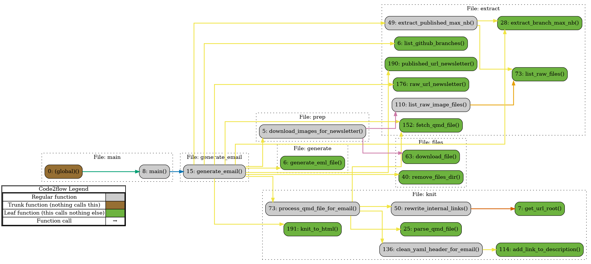
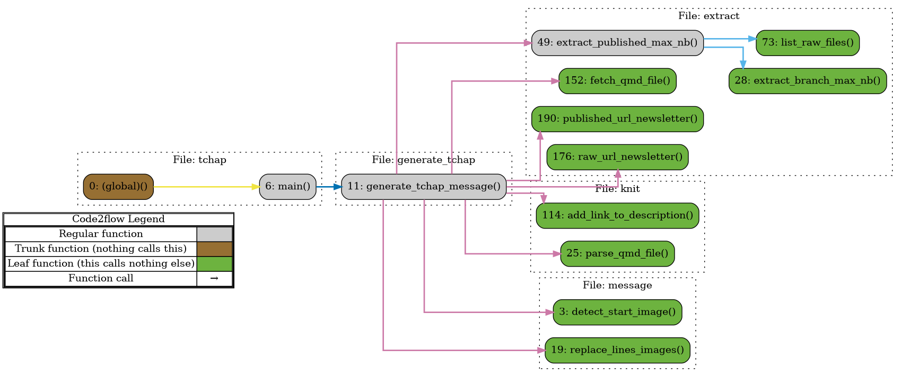
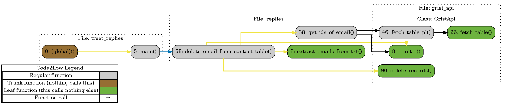

# Objective

Tools to manage [SSPHub's](https://ssphub.netlify.app/) directory and [SSPHub's](https://ssphub.netlify.app/) newsletter system.

Des assistants IA ont été utilisés pour la documentation ou le code de ce repo. 

# Use

## Requirements

- Have access to GRIST directory
- Have environment variables :
  - GRIST_API_KEY : your API Key to use Grist (see [GRIST documentation](https://support.getgrist.com/rest-api/) to see how to access it)
  - GRIST_SSPHUB_DIRECTORY_ID : GRIST id of the SSPHub's Directory document (available on Grist)
  - GRIST_SSPHUB_WEBSITE_MERGE_ID : GRIST id of the internal table to merge old website to new website (available on Grist)
  - EMAIL_VALIDATION_TO, EMAIL_VALIDATION_CC, EMAIL_SSPHUB : email addresses

- Pour générer l'email de newsletter, les images doivent être stockées dans le repo git. Les images incluent directement avec des liens ne seront pas inclues dans l'email
- la newsletter doit être stockée dans un fichier "index.qmd" stocké dans infolettre/infolettre_XX où XX est le numéro de l'infolettre. Si pas là, le lien de la newsletter publiée dans l'email ne sera pas le bon.
- Les liens internes vers d'autres pages du site peuvent être écrits relativement, comme dans le site (par exemple `[texte](../../blog/2026_rencontresR/index.qmd)`). Lors de la génération de l'email, ils sont automatiquement réécrits en URLs absolues du site publié (`https://ssphub.netlify.app/...`) : `../../` pointe vers la racine du site (sections `blog/`, `event/`...) et `../` vers le dossier `infolettre/`. 
- Si pas de branche spécifiée, le script ira prendre celle dont le nom est au format 'infolettre_XX', avec le nom du folder où aller chercher le "index.qmd" identique.

## Step by step

### Newsletter

L'objectif ici est de valider et d'envoyer la newsletter du SSPHub aux membres inscrits sur Grist.

#### Validation de la newsletter :

- Faire une PR sur le site
- Envoyer le lien à RL, MH
- reprendre les commentaires
- Ouvrir Onyxia
- Avoir ce repo chargé
- `cd newsletter_tools`
- To generate email :
  - from the CLI, use `uv run clearance.py`.
    - By default, clearance.py will catch the branch named "infolettre_NN" (NN a number) and retrieve NN as the number of the infolettre.
    - If you specify branch and number, do it with `uv run clearance.py -n 21 -b infolettre_21`
  - deprecated - You can also do it manually by going to script.py, and run function generate_email with Object. But it creates issues with working directory for css (file : email/css/style.css)
- download email
- add text to say It's the newsletter for clearance
- send it

#### Envoi de la newsletter

- Email :
  - CAUTION - Infolettre must have been merged into main before going further. 
  - To generate draft email :
    - from the CLI, use uv run main.py.
      - By default, main.py will look for folders named infolettre/infolettre_NN in the main branch and retrieve the max number.
      - For example `uv run main.py -o "[SSPHub] - Infolettre de décembre 2026"` to specify the object of the email.
    - deprecated - You can also do it manually by going to script.py, and run function generate_email with Object.
      But it creates issues with working directory for css (file : email/css/style.css)
  - Download email
  - Check the newsletter (format, typos etc)
  - Select the right Outlook account
  - Deal with FMB and global lists -- no need
  - Press Send
- Tchap :
  - to generate tchap message : from the CLI, use `uv run tchap.py`. Infolettre nb is an optionnal argument (it will fetch it directly from the main branch). If you want to specify it, do it with `uv run main.py -n 23 `
  - copy paste txt stored in .temp/tchap_message.txt in the SSPHub Tchap group

#### Après envoi :

- Cleaning de la mailing list : copier tous les messages d'erreurs dans le fichier "newsletter_tools/replies.txt"
- Pour les supprimer : from the CLI, use uv run treat_replies.py with file path as argument. If file is "newsletter_tools/replies.txt", no need to specify file path. For example `uv run treat_replies.py -f otherfolder/replies.txt` or `uv run treat_replies.py` if default file is used
- the script returns a dataframe with extracted emails, and the one matched in the directory. If emails are not found, it wont delete any email.

### Fusion site SSPHub / SSPLab (deprecated)

- (deprecated) To import draft template to SSPHub's site, go to script.py and run fill_all_templates_from_grist

# Documentation



The graph can be generated with `graphs.sh`

## Clearance

Clearance is done with script clearance.py. 
Function to generate a draft email based on newsletter number and branch name of the repo for clearance.
The script automatically detects the branch and newsletter number if not specified.
Not necessary to have published the newsletter.

How the clearance.py script works : 

### Function: `main(*args, **kwargs)`

- **Description**: Wrapper for `generate_email`. All arguments are passed directly to `generate_email`.
- **Args**: See `[generate_email](#generate_email-function)` for details.

### Command-Line Arguments


| Argument         | Short   | Type   | Default                                  | Description                                                                                                                         |
| ---------------- | ------- | ------ | ---------------------------------------- | ----------------------------------------------------------------------------------------------------------------------------------- |
| `--number`       | `-n`    | `str`  | `None`                                   | Newsletter number (e.g., `21`). If not provided, the script auto-detects the highest number from branches matching `infolettre_XX`. |
| `--branch`       | `-b`    | `str`  | `None`                                   | Branch name (e.g., `infolettre_21`). If not provided, the script auto-detects the branch.                                           |
| `--email_object` | `-o`    | `str`  | `[SSPHub] Pour validation - infolettre`  | Subject line of the email.                                                                                                          |
| `--email_to`     | `-to`   | `str`  | `EMAIL_VALIDATION_TO` (env)              | Recipient(s) for the email (semicolon-separated).                                                                                   |
| `--email_bcc`    | `-bcc`  | `str`  | `""`                                     | BCC recipient(s) (semicolon-separated).                                                                                             |
| `--email_from`   | `-from` | `str`  | `""`                                     | Sender email (display name in Outlook).                                                                                             |
| `--email_cc`     | `-cc`   | `str`  | `EMAIL_VALIDATION_CC;EMAIL_SSPHUB` (env) | CC recipient(s) (semicolon-separated).                                                                                              |
| `--drop_temp`    | `-t`    | `bool` | `True`                                   | If `True`, deletes temporary files (`.qmd`, `.html`) after generating the email.                                                    |

### Examples 

#### Generate a validation email for the latest newsletter:

```bash
uv run clearance.py
```

- Auto-detects the max branch (e.g., `infolettre_21`) and number (e.g., `21`).
- Uses default recipients and subject.

#### Generate a validation email for a specific newsletter:

```bash
uv run clearance.py -n 21 -b infolettre_21 -o "[SSPHub] Validation - Infolettre 21"
```

- Explicitly specifies the newsletter number, branch, and subject.

#### Generate a validation email and keep temporary files:

```bash
uv run clearance.py --no-drop_temp
```

- Temporary files (`.qmd`, `.html`) are **not** deleted.

### Workflow

1. Auto-detects the branch and newsletter number if not provided.
2. Fetches the `.qmd` file from the specified branch.
3. Converts the `.qmd` file to HTML and generates an `.eml` file in the `.temp/` directory.
4. Deletes temporary files unless `no-drop_temp` is raised.



## Main

Script to send newsletter is in `main.py`. 
Function to generate a draft email based on newsletter number in the `main` branch of the repo.
Very similar to generate email for clearance, except that it retrieves the directory and that newsletter must be published..


### Function: `main(*args, **kwargs)`

- **Description**: Wrapper for `generate_email`. All arguments are passed directly to `generate_email`.
- **Args**: See `[generate_email](#generate_email-function)` for details.

### Command-Line Arguments


| Argument         | Short   | Type  | Default                       | Description                                                                                                                                                   |
| ---------------- | ------- | ----- | ----------------------------- | ------------------------------------------------------------------------------------------------------------------------------------------------------------- |
| `--number`       | `-n`    | `str` | `None`                        | Newsletter number (e.g., `21`). If not provided, the script auto-detects the highest number from the `infolettre/infolettre_XX` folders in the `main` branch. |
| `--branch`       | `-b`    | `str` | `main`                        | Branch name. Defaults to `main` (published newsletters).                                                                                                      |
| `--email_object` | `-o`    | `str` | `[SSPHub] Infolettre de mars` | Subject line of the email.                                                                                                                                    |
| `--email_to`     | `-to`   | `str` | `EMAIL_SSPHUB` (env)          | Recipient(s) for the email (semicolon-separated).                                                                                                             |
| `--email_bcc`    | `-bcc`  | `str` | `get_emails()`                | BCC recipient(s) (semicolon-separated). Fetches emails from the SSPHub directory via Grist API.                                                               |
| `--email_from`   | `-from` | `str` | `""`                          | Sender email (display name in Outlook).                                                                                                                       |
| `--email_cc`     | `-cc`   | `str` | `""`                          | CC recipient(s) (semicolon-separated).                                                                                                                        |
| `--drop_temp`    | `-t`    | `bool` | `True`                                   | If `True`, deletes temporary files (`.qmd`, `.html`) after generating the email.                                                          |

### Examples

#### Generate a sending email for the latest published newsletter:

```bash
uv run main.py
```

- Auto-detects the highest newsletter number from the `main` branch.
- Uses default recipients and subject.

#### Generate a sending email for a specific newsletter:

```bash
uv run main.py -n 21 -o "[SSPHub] Infolettre 21 - Juin 2026"
```

- Explicitly specifies the newsletter number and subject.

#### Generate a sending email and delete temporary files:

```bash
uv run main.py --no-drop_temp
```

- Temporary files (`.qmd`, `.html`) are **not** deleted.

---
### Workflow

1. Auto-detects the newsletter number from the `main` branch if not provided.
2. Fetches the `.qmd` file from the `main` branch.
3. Converts the `.qmd` file to HTML and generates an `.eml` file in the `.temp/` directory.
4. Deletes temporary files if `drop_temp="True"`.



## Tchap

Function to generate a draft Tchap version of the newsletter based on its number.
Newsletter must be published.



## Treat replies

Function to delete a detect emails and delete them from directory after newsletter has been sent.




# Common Issues

1. **Missing Environment Variables**:
  - Ensure all required environment variables (e.g., `EMAIL_VALIDATION_TO`, `GRIST_API_KEY`) are set.
  - Example error: `KeyError: 'EMAIL_VALIDATION_TO'`.
2. **Branch/Number Not Found**:
  - If the branch or newsletter number cannot be auto-detected, specify them explicitly using `-n` and `-b`.
3. **GitHub API Limits**:
  - The scripts fetch data from GitHub. If you hit rate limits, wait or use a GitHub token.
4. **Grist API Errors**:
  - Ensure `GRIST_API_KEY` and `GRIST_SSPHUB_DIRECTORY_ID` are correct.


